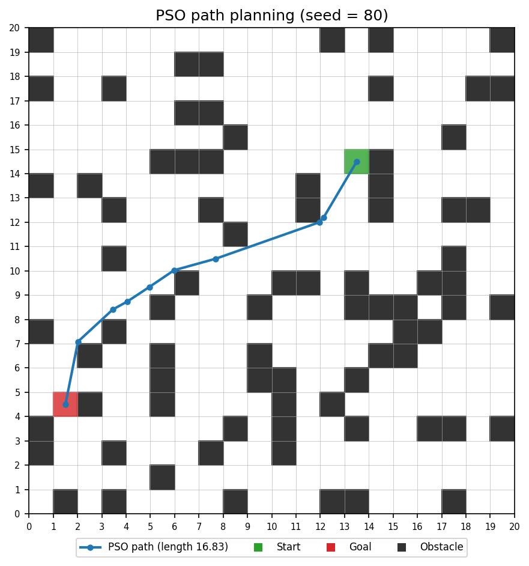
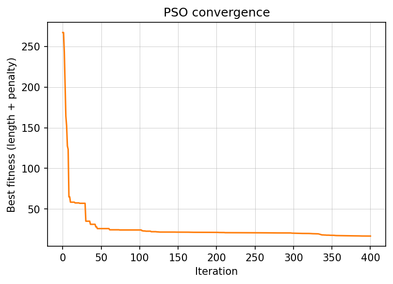

# Swarm-Based Path Planning with Obstacles (PSO)

Swarm Intelligence Lab, Assignment 1

- **Name:** YOUR NAME HERE
- **Roll number:** 80
- **Seed used:** `80` (`random.seed(80)`, set in `grid.py` as `SEED = ROLL_NUMBER`)

## Problem instance

Nothing is hardcoded. `grid.py` builds the whole problem from the seed:

- 20 x 20 grid, 20% of the cells blocked (80 obstacles)
- Start and goal are drawn from free cells, at least `size` apart (Manhattan distance)
- The instance is checked with a BFS so a free route always exists

For seed 80 this gives start `(13, 14)` and goal `(1, 4)`. Changing the seed changes the whole problem.

## Approach

Each particle encodes a path as 8 intermediate waypoints `(x1, y1, ..., x8, y8)` in continuous grid coordinates. The full path is start, the 8 waypoints, goal, joined by straight segments.

The fitness (to minimise) is:

`fitness = path length + 30 x (number of obstacle / out-of-bounds cells touched by the path)`

Segments are sampled every 0.05 cells to detect collisions, so a path that cuts through an obstacle is heavily penalised and the swarm is pushed toward short, collision-free routes.

PSO settings: 150 particles, 400 iterations, inertia decaying linearly from 0.9 to 0.4, c1 = c2 = 1.8, velocity clamped to 20% of the search range. The initial swarm places waypoints on random free-cell centres, which gave a much better start than uniform random positions.

Each iteration: update velocity and position, evaluate fitness (which includes the collision check), update personal and global bests, stop after the last iteration, output the best path.

## Result (seed 80)

- Best path length: **16.83** cells (straight-line distance is about 15.62)
- Collisions: **0**





## Hand-drawn flow diagram


## How to run

```bash
git clone <this-repo-url>
cd swarm-pathplanning-80
pip install -r requirements.txt
python main.py
```

The run prints the seed, start, goal, best path length and collision count, and saves `results/path.png` and `results/convergence.png`.

## Files

- `grid.py`: seeded grid, obstacle, start and goal generation
- `pso.py`: generic PSO optimiser
- `planner.py`: path encoding, collision check, fitness
- `visualize.py`: plots
- `main.py`: runs everything
